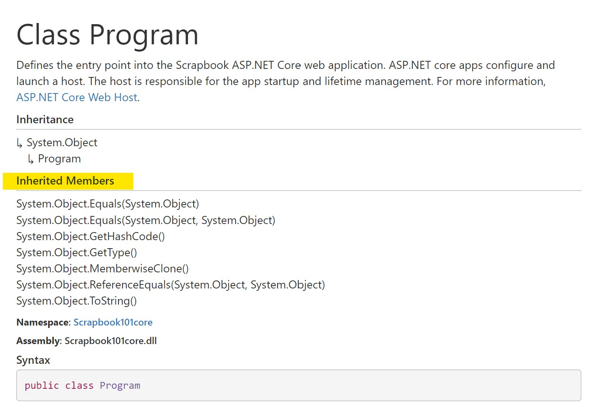
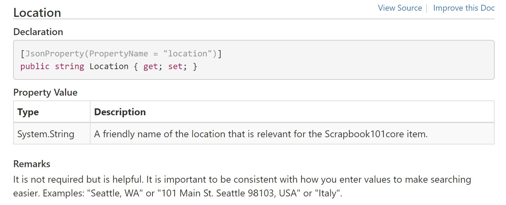

# About This Site

## Overview

This site was created with [DocFx][docfx]. How is this site different from our [GitHub pages site][site1] for Scrapbook101? 

* This site parses comments from code (under [Scrapbook101core][cide]) and creates API documentation together with conceptual content (under **\articles**). The conceptual documentation from the GitHub pages site was reused here with few changes. 

* In the previous [site][site1], we used Jekyll to create the website, which contained only conceptual content. We used Jekyll to run local builds and then pushed the .md files to GitHub into a **\docs** folder, which we defined as a GitHub pages website. There, the Jekyll process would kick off automatically and create the HTML for the [site][site1].

* This site relies only on DocFx. We still work offline (currently), run DocFx to produce the website with both conceptual and API documentation, and then push to Github **\docs** folder. The difference with our Jekyll site is that here we are pushing the HTML files and are not relying on Jekyll to build HTML for us.


## Initial steps

We started by running `docfx init` to create a simple documentation website. We played around with that for a bit, following the [walkthroughs][walk].

After that initial simple documentation website, we started reading up on using [C# XML documentation][ref3]. 

Then, we merged the simple documentation website structure with {{productName}}. Specifically, we created a **\docs** and **\docbuild** folder parallel to code folder. In the **\docbuild** folder, we run `docfx` to gather metadata and build HTML. Then as a final step, we copy the **\doc\build\ _site content** over to **\docs**.

Our local process:

1. Start in root folder.
    * In this case, it is the directory we cloned from GitHub, "scrapbook101core".
1. Change directory to **\docbuild**.
    * There should be a docfx.json file in the root of this folder. We copied the filed from the walkthrough.
    * If you didn't start with a docfx walkthrough, you can use the `docfx init` subcommand to generate an initial docfx.json file.
1. Run `docfx metadata`.
    * This generates YAML files from source code.
1. Run `docfx build`.
    * This generates client-only website combining API in YAML files and conceptual files.
1. Run `docfx --serve`
    * This command executes the subcommands `metadata` and `build` and then creates a local web server to host the pages. So the previous two steps can be skipped. They were shown just to talk about what's happening behind the scenes.
    * To use a different port try `docfx --serve --port=8090`.
    * Hosting the pages is not strictly necessary. If you ran `docfx metadata` and `docfx build`, then at this point you can navigate to the **_site** folder and just open the index.html file without creating a local web server to host.
1. Copy all content from **\docbuild\ _site** to **\docs**.
    * The copy operation is because DocFx is not integrated with GitHub Pages ([issue][issue3284]).
    * The downside of this is that we end up pushing a lot of files (HTML and supporting files).
1. Commit, push changes to GitHub.
    * Don't forget to check you .gitignore file and make sure **_site** is excluded because we'll be publishing the docs in the **\docs** folder.


The directory structure at the root of Scrapbook101Core looks like this:

```
├───docbuild
│   ├───api
│   ├───articles
│   ├───images
│   ├───obj
│   └───_site
│       ├───api
│       ├───articles
│       ├───fonts
│       └───styles
├───docs
│   ├───api
│   ├───articles
│   ├───fonts
│   ├───images
│   └───styles
└───{{productName}}
    ├───Assets
    ├───bin
    ├───Controllers
    ├───Models
    ├───obj
    ├───Properties
    ├───Views
    └───wwwroot
```

### Gotchas

Some things we ran into:

* When testing the [walkthroughs][walk], we used the suggested folder naming **\docfx_walkthrough\docfx_project**. Then, in the context of the walkthrough,
we pointed to {{productName}} code just to see what would happen and it built fine. However, when we then created the **\docbuild** folder inside of {{productName}} and tried to run `docfx metadata`, it was still looking for the **\docfx_project**. The culprit: **\{{productName}}\obj\xdoc\cache**. We deleted the cache folder and it started working.

* In the process of ensuring we can always build everything from scratch, we often wipe out the .yml files in the **\api** folder. But be careful not to wipe out the index.md file if that is what you are pointing to in root toc.yml.

* Pay attention to warnings in docfx output, they are useful.

* Using the Jekyll process, we could define global site variables like {{productName}}, where site.sn = "Scrapbook101". With the docfx process, we haven't figured out how to do that.

## Customization

### Learn about templates

Starting with the [advanced walkthrough][awalk] as guidance, we did the following as a test:

1. See what templates are available with `docfx template list`. We are interested in the default template.

1. Export the default template with `docfx export default`. 
    * This will created a folder called **_exported_templates**.  Either add this to .gitignore or delete after done.

1. In our **\docbuild** folder create a **templates\cust-template** folder.

1. Decide to change the footer template of the site to add the name of our site. So in **_exported_templates\default\partials** copy the footer.tmpl.partial file to **docbuild\templates\cust-template\partials**.

1. Edit the footer.tmpl.partial file to add "{{productName}}".
    * The .templ is a Mustache template file used by [renderers][renderers].
    * In this simple case, it's obvious where to add the extra text "{{productName}}"

1. In the **build** key of docfx.json reference the custom template.
   
   ```
    "template": [
        "default",
        "templates/cust-template"
    ],
    ```

1. Build site and verify changes.

Perhaps a simpler way to make this change would habe been to specify the _appFooter as globalMetadata. See the [below](about-this-site.md#specify-site-title) for changing _appTitle.

### Tweak reference template

The goal is to removed the inherited members section as shown below:




1. Find the correct template **_exported_templates\default\partials\class.header.tmpl.partial** and copy to corresponding folder in **\cust-templates**.

2. Edit out the inherited members part:

    ```
    {{#inheritedMembers.0}}
    <div class="inheritedMembers">
    <h5>{{__global.inheritedMembers}}</h5>
    {{/inheritedMembers.0}}
    {{#inheritedMembers}}
    <div>
    {{#definition}}
        <xref uid="{{definition}}" text="{{nameWithType.0.value}}" alt="{{fullName.0.value}}"/>
    {{/definition}}
    {{^definition}}
        <xref uid="{{uid}}" text="{{nameWithType.0.value}}" alt="{{fullName.0.value}}"/>
    {{/definition}}
    </div>
    {{/inheritedMembers}}
    {{#inheritedMembers.0}}
    </div>
    {{/inheritedMembers.0}}
    ```
3. Build and verify.

### Links and cross references via UID. 

For example, here is a link to <xref:code-discussion> file using its UID. Here is a link to a class in the API documentation using its UID: <xref:Scrapbook101core.Models.Item>. Or we can change the text for the API link as so [The Item Class](xref:Scrapbook101core.Models.Item). Here's the [help page][linkhelp] on linking.

Here are those links in markdown:

```
<xref:code-discussion>
<xref:Scrapbook101core.Models.Item>
[The Item Class](xref:Scrapbook101core.Models.Item)
```

How to link to a code file?  Here's an full qualified path link: [appsettings.json](https://github.com/travelmarx/scrapbook101core/blob/master/{{productName}}/appsettings.json). Is there another way to do it?


### Specify site title

In the docfx.json file, under the **build** key, specify this:

```json
"globalMetadata" : { "_appTitle": "{{productName}}" },
```

which will add this text to the title of every page, as viewed in browser tab. The _appTitle is added to the UID of each page, so for the "Get Started" page, the title is "Get Started | {{productName}}". For more information on reservied metadata you can use, see [reserved metadata][metadata].

### Add a global variable

Our goal is to add a global variable to represent the site/product name "{{productName}}" so that in conceptual markdown files we could just put `{{productName}}` and have the build process substitute the correct value.

Here's how we achieved it. (It may not be the most elegant way.)

1.  Export the default template with `docfx export default` if you haven't already.
    * This will created a folder called **_exported_templates**.  Either add this to .gitignore or delete after done.

1. In our **\docbuild** folder create a **templates\cust-template** folder, if you haven't already.

1. Copy the file conceptual.extension.js from **_exported_templates** to **templates\cust-template**.

1. Start with some simple experiments adding JavaScript code to the conceptual.extension.js file and always rebuilding.

    1. For example, in the `exports.postTransform` function add code to confirm you can see the warning line in the output when you run `docfx --serve`.

        ```javascript
        exports.postTransform = function (model) {
            console.warn("******************postprocessor******************");
            return model;
        }
        ```

    1. Next, take a look at what the model is with:

        ```javascript
        exports.postTransform = function (model) {
            console.warn("******************postprocessor******************");
            console.warn(JSON.stringify(model));
            return model;
        }
        ```

        From the output of `docfx --serve`, copy an example of the stringified model object and put it into a .json file and format it. For a conceptual file, you should see a form something like this:

        ```json
        {
            "conceptual": "..."
            "type": "Conceptual",
            "source": {...}
            ...
        }
        ```

        From this output, you can see what you can access in the model.

1. In the docfx.json file put thisunder the "build" key:

    ```json
    "globalMetadata" : { "_appTitle": "{{productName}}", "productName": "Scrapbook101core" },
    ```

1. Read this value from the model and use it to substitute in the model by adding this code to conceptual.extension.js:

    ```javascript
    String.prototype.replaceAll = function(search, replacement) {
        var target = this;
        return target.split(search).join(replacement);
    };

    exports.postTransform = function (model) {
    model.conceptual = model.conceptual.replaceAll("{{productName}}", model["productName"] );
    return model;
    }
    ```

    The `replaceAll` functionality came from a suggestion in [Stack Overflow][replaceAll]. If you needed this functionality more widely, you could put the prototype function in the common.js file.

### Triple-slash for properties

We started to document the [`Item class`](xref:Scrapbook101core.Models.Item) to understand how different tags render and what our "style" would be. For example, to document the properties, we have three useful tags:

```
/// <summary>
/// A summary.
/// </summary>
/// <value>
/// The property value description.
/// </value>
/// <remarks>
/// Additional information about the property.
/// </remarks>
```

These tags render in the order shown above, regardless of how you arrange them.

We decided that the **summary** tag was too much for property documentation and decided to go with just the **value** and **remarks** tags. And, the **value** tag would have just a short description, one to two sentences while the **remarks** would be any clarifying information. For example, for the [`Location`](xref:Scrapbook101core.Models.Item#Scrapbook101core_Models_Item_Location) property:

```
/// <value>
/// A friendly name of the location that is relevant for the Scrapbook101core item.
/// </value>
/// <remarks>
/// It is not required but is helpful. It is important to be consistent with how you enter
/// values to make searching easier.
/// Examples: "Seattle, WA" or "101 Main St. Seattle 98103, USA" or "Italy".
/// </remarks>
[JsonProperty(PropertyName = "location")]
public string Location { get; set; }
```

which renders as: 



### Build pipeline

First steps...

1. Go to Azure devops signin.

1. Create a project "Scrapbook101core" in the organization that was created.

1. Go to Pipelines, and create a new Build pipeline.

1. Connect to GitHub and select Scrapbook101core and Run.

1. Configure the pipeline as "ASP.NET Core".
   
   This will create a azure-pipeline.yml file. Save and run it. (You can commit directly into master or create a branch that you'll have to merge.)
   The file is at the root of the GitHub project.

    ```yaml
    # ASP.NET Core
    # Build and test ASP.NET Core projects targeting .NET Core.
    # Add steps that run tests, create a NuGet package, deploy, and more:
    # https://docs.microsoft.com/azure/devops/pipelines/languages/dotnet-core

    trigger:
    - master

    pool:
    vmImage: 'ubuntu-latest'

    variables:
    buildConfiguration: 'Release'

    steps:
    - script: dotnet build --configuration $(buildConfiguration)
      displayName: 'dotnet build $(buildConfiguration)'
    ```

Some notes:

* Do I pay? There is a [free tier][freetier] Azure Dev Ops options to get started.

* What happened above? The steps built the site as if you ran build in Visual Studio. We could and should insert tests for code coverage and quality?

* If you make a changes to any file in the repo, the build process will kick off again because the **trigger** parameter in the pipeline config file.

Next steps...

Read up on [jobs][jobs] and [agents][agents]. The idea is that we can build the docs in the build pipeline. (Or would that be better in the release phase?)

1. Create a simple job. Add to the azure-pipelines.yml file to say "Hello World".

    ```yaml
    steps:
    - bash: echo "Hello World"
    - script: dotnet build --configuration $(buildConfiguration)
      displayName: 'dotnet build $(buildConfiguration)'
    ```

1. Create different agents. Add this to config and run:

    ```yaml
    jobs:
    - job: Linux
    pool:
        vmImage: 'ubuntu-latest'
    steps:
    - script: echo hello from Linux
    - bash: echo "Hello World"
    - script: dotnet build --configuration $(buildConfiguration)
        displayName: 'dotnet build $(buildConfiguration)'
    - job: macOS
    pool:
        vmImage: 'macOS-latest'
    steps:
    - script: echo hello from macOS
    - job: Windows
    pool:
        vmImage: 'windows-latest'
    steps:
    - script: echo hello from Windows
    ```

To file:

* https://docs.microsoft.com/en-us/azure/devops/pipelines/repos/pipeline-options-for-git?view=azure-devops

## Future

Create a Azure pipeline process to build docs automatically. The flow would be then:

1. Author comments in code.
2. Check in code changes.
3. Kick off or set up pipeline to automatically build upon changes to code. TBD.


## References

* [DocFx: Metadata Format for .NET Language][ref2]

* [DocFX: Triple Slash Comments Support][ref3]

* [XML Documentation Comments (C#)][ref4]

* [Documenting your code with XML comments][ref1]

* [Customizing template](https://stackoverflow.com/questions/56458435/docfx-how-to-suppress-certain-info-about-type-inheritance-constructors-assem)


[docfx]: https://dotnet.github.io/docfx/
[walk]: https://dotnet.github.io/docfx/tutorial/walkthrough/walkthrough_overview.html
[awalk]: https://dotnet.github.io/docfx/tutorial/walkthrough/advanced_walkthrough.html#create-a-new-template
[ref1]: https://docs.microsoft.com/dotnet/csharp/codedoc
[ref2]: https://dotnet.github.io/docfx/spec/metadata_dotnet_spec.html
[ref3]: https://dotnet.github.io/docfx/spec/triple_slash_comments_spec.html
[ref4]: https://docs.microsoft.com/dotnet/csharp/programming-guide/xmldoc/
[site1]: https://travelmarx.github.io/scrapbook101/
[code]: https://github.com/travelmarx/scrapbook101core/tree/master/Scrapbook101core
[issue3284]: https://github.com/dotnet/docfx/issues/3284
[linkhelp]: https://dotnet.github.io/docfx/tutorial/links_and_cross_references.html
[renderers]: https://dotnet.github.io/docfx/tutorial/intro_template.html#renderer
[metadata]: https://dotnet.github.io/docfx/tutorial/docfx.exe_user_manual.html#322-reserved-metadata
[replaceAll]: https://stackoverflow.com/questions/1144783/how-to-replace-all-occurrences-of-a-string
[freetier]: https://azure.microsoft.com/en-us/pricing/details/devops/azure-devops-services/
[jobs]: https://docs.microsoft.com/en-us/azure/devops/pipelines/process/phases
[agents]: https://docs.microsoft.com/en-us/azure/devops/pipelines/agents/hosted