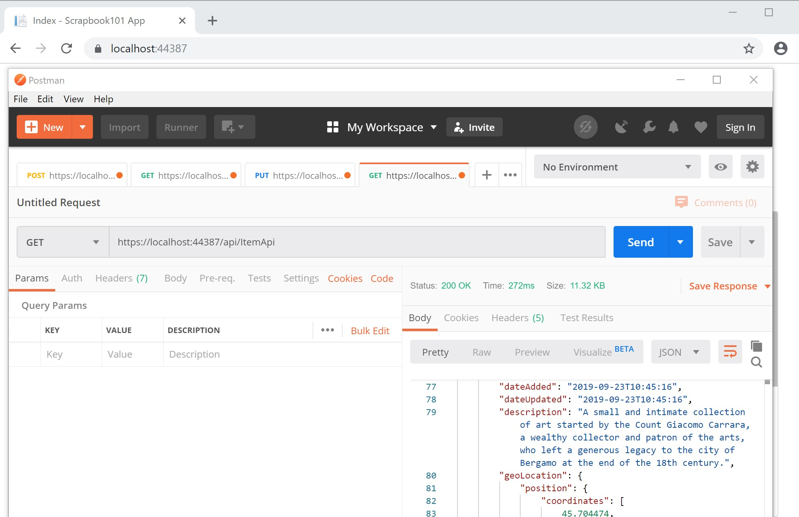

# Adding a Web API

Last update: 2019-11-05

What are we trying to do? We built Scrapbook101core as a web interface and then decided we wanted to create a web API to handle HTTP requests. The web API allows for other use ways to interact with Scrapbook101core beyond the browser. This page describes some of the steps we went through to add a Web API to an existing ASP.NET core web site.

## Initial steps

As usual, we started by following a tutorial: [Web API Tutorial][webapitut]. A lot of effort goes into creating this type of tutorial experience, so why not use it? And it's our old friend, the Todo List.

After running the tutorial, we realized our first decision point was whether to use the same controller classes for both views (web interface) and web APIs. We decided that we wanted to separate the functionality at the risk of repeating some code.

Another initial step was to install [Postman][postman], a collaboration platform for API development that includes an easy what to construct and send HTTP requests.

## Create the controller 

Our next step is to create a new controller called [ItemApiController](xref:Scrapbook101core.Controllers.ItemApiController). We decided to keep the controller name similar to existing [ItemController](xref:Scrapbook101core.Controllers.ItemController) but with "Api" added. We added the controller using scaffolding in Visual Studio, i.e., just added it following the menus:

1. Select the **Controllers** folder, right click and select **Add** > **Controller**.

1. Select API Controller with read/write actions. (We are not using the Entity Framework.) In the course of experimenting with adding API controllers, we ended up pulling in Microsoft.EntityFrameworkCore.SqlServer.Design and Microsoft.EntityFrameworkCore.Tools in the .csproj file

1. A new controller .cs file is generated. Note we are inheriting from ControllerBase. Here's the skeleton of the class:

```c#
using System.Collections.Generic;
using Microsoft.AspNetCore.Mvc;

namespace Scrapbook101core.Controllers
{
    [Route("api/[controller]")]
    [ApiController]
    public class ItemApiController : ControllerBase
    {
        // GET: api/ItemApi
        [HttpGet]
        public IEnumerable<string> Get()
        {
            return new string[] { "value1", "value2" };
        }
        // GET: api/ItemApi/5
        [HttpGet("{id}", Name = "Get")]
        public string Get(int id)
        {
            return "value";
        }
        // POST: api/ItemApi
        [HttpPost]
        public void Post([FromBody] string value)
        {
        }
        // PUT: api/ItemApi/5
        [HttpPut("{id}")]
        public void Put(int id, [FromBody] string value)
        {
        }
        // DELETE: api/ApiWithActions/5
        [HttpDelete("{id}")]
        public void Delete(int id)
        {
        }
    }
}
```

## GET method

After createing the skeleton controller, we needed to get one method working and the simplest to get working is the GET method that returns items. This task seemed easy but was a little tricky. We needed to read up on [Action return types][actionresult] and get some help on an implicit conversion error below [here][converterr] and [here][git8061]. The error was this::

*Cannot implicitly convert type 'System.Collections.Generic.IEnumerable<Scrapbook101core.Models.Item>' to 'Microsoft.AspNetCore.Mvc.ActionResult<System.Collections.Generic.IEnumerable<Scrapbook101core.Models.Item>>'	Scrapbook101core*

The solution was to simply use `.ToList` so that our simple GET method then became this:

```c#
// GET: api/ItemApi
[HttpGet]
public async Task<ActionResult<IEnumerable<Item>>> GetAsync()
{
    var items = await DocumentDBRepository<Item>
        .GetItemsAsync(item => item.Type == AppVariables.ItemDocumentType);
    var imagePath = HelperClasses.BuildPathList(items);
    return items.ToList();
}
```

Note that we made the method asynchronous. What's important to also note is what are are not handling:

* paging (return page token); currently we just return everything

* an indication of the base URL to access assets

Here's an example of using Postman to test the GET to return all items.



## All methods


Method | URI | Notes
--- | --- | ---
GET | /api/ItemApi | Returns all items.
GET | /api/ItemApi/GUID | Returns the details for the specified item matching the GUID.
DELETE | /api/ItemApi/GUID | Deletes the item matching the GUID.


[webapitut]: https://docs.microsoft.com/en-us/aspnet/core/tutorials/first-web-api?view=aspnetcore-3.0&tabs=visual-studio
[postman]: https://www.getpostman.com/downloads/
[actionresult]: https://docs.microsoft.com/en-us/aspnet/core/web-api/action-return-types?view=aspnetcore-2.1#actionresultt-type
[converterr]: https://stackoverflow.com/questions/50383193/cannot-implicitly-convert-type-to-actionresultt?noredirect=1&lq=1
[git8061]: https://github.com/aspnet/Mvc/issues/8061

