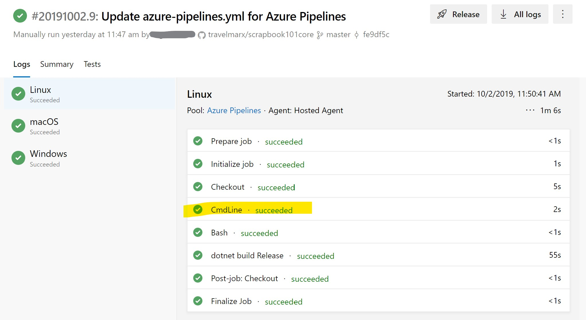

# Pipeline setup

## Overview

Our goal is to create a Azure pipeline process to build docs (and ran other tasks) automatically upon checkin of code. To do this, we need to look into Devops. The term is a compound of development (Dev) and operations (Ops) and represents the union of people, process, and technology to continually provide value to customers. For more information, see [What is DevOps?][devops-def]. In particular, we'll be using Azure Devops, which contains ways to implement continuous integration (CI) and continuous delivery (CD) processes using a *pipeline*. A pipeline in its simpleset sense is a series of tasks you want to run. In our case, we want to compile code, optionally run any tests and code checking, and create the documentation with [DocFx][docfx].

Our desired authoring and developer flow is:

1. Code or author comments in code.

2. Check in changes.

3. A pipeline automatically build upon detected changes to code.

## Starting setup

To approach the idea process flow described above, our first steps in devopsland went something like this:

1. Go to [Azure devops][devops].

1. Create a project "Scrapbook101core" in the organization that was created.

1. Go to Pipelines section, and create a new Build pipeline.

1. Connect to GitHub, select the Scrapbook101core repo, and Run.

1. Configure the pipeline as "ASP.NET Core". For more information see [Build, test, and deploy .NET Core apps][devops-core]
      
   This will create a azure-pipeline.yml file. Save and run it. (You can commit directly into master or create a branch that you'll have to merge.) The config file is at the root of the GitHub project.

    ```yaml
    trigger:
    - master

    pool:
    vmImage: 'ubuntu-latest'

    variables:
    buildConfiguration: 'Release'

    steps:
    - script: dotnet build --configuration $(buildConfiguration)
      displayName: 'dotnet build $(buildConfiguration)'
    ```

Notes:

* Do I pay? There is a [free tier][freetier] Azure Dev Ops options to get started. For small tests and limited use, you won't pay.

* What happened above? The steps built the site as if you ran build in Visual Studio. (To do: We could and should insert tests for code coverage and quality.)

* If you make a changes to any file in the repo, the build process will kick off again because the **trigger** parameter in the pipeline config file.

## Custom build task

So far, so good. Our next step was to play around with the config file. First, read up on [jobs][jobs] and [agents][agents]. The idea is that we can build the docs in the build pipeline. But before doing that, we need to know about running tasks.

1. Create a simple job. Modify the azure-pipelines.yml file to say "Hello World". Run to test.

    ```yaml
    steps:
    - bash: echo "Hello World"
    - script: dotnet build --configuration $(buildConfiguration)
      displayName: 'dotnet build $(buildConfiguration)'
    ```

1. Create different agents. Add this to config and run.

    ```yaml
    jobs:
    - job: Linux
      pool:
        vmImage: 'ubuntu-latest'
      steps:
      - script: echo hello from Linux
      - bash: echo "Hello World"
      - script: dotnet build --configuration $(buildConfiguration)
        displayName: 'dotnet build $(buildConfiguration)'
    - job: macOS
      pool:
        vmImage: 'macOS-latest'
      steps:
      - script: echo hello from macOS
    - job: Windows
      pool:
        vmImage: 'windows-latest'
      steps:
      - script: echo hello from Windows
    ```

    In the screenshot below, clicking on the **cmdline** task would show the output from the echo commands in the config file.

    


1. Go back to simpler config file based on **vmImage** = 'windows-latest'. Save  and run.

    ```yaml
    trigger:
    - master

    pool:
    vmImage: 'windows-latest'

    variables:
    buildConfiguration: 'Release'

    steps:
    - script: echo "hello from Windows"
    - script: dotnet build --configuration $(buildConfiguration)
    displayName: 'dotnet build $(buildConfiguration)'
    ```

## PowerShell task

The next step is to figure out how to run a PowerShell script with the idea that we will create a PowerShell build script. So, let's start with "Hello World".

1. Create a simple Powershell script and check it into the repo at **.\scripts\builddocs.ps1**

    ```ps1
    write-host "Hello World from PowerShell!"
    ```
1. Modify the config above to use this script. (Here's a [help page][pstask].)

    ```yaml
    steps:
    - pwsh: .\scripts\builddocs.ps1
    - script: dotnet build --configuration $(buildConfiguration)
    displayName: 'dotnet build $(buildConfiguration)'
    ```

The [hosted Windows 2019][vmImage] we are using has a pre-installed software: 

* Also on the image is [Powershell Core][ps-core], a cross-platform (Windows, Linux, and macOS) version of PowerShell.

* One important component is [Chocolatey][choco], a Windows package manager. We'll use Chocolately to install [DocFx][docfx].

These two components together will be enough to run our builddocs.ps1 script.

## Build task

After a bit of trial and error we ended up with the [builddocs.ps1][build-script].

Script path on agent D:\a\1\s
Change directory for example D:\a\1\s\docbuild

Here are the approximate steps:


To do:

* What does it mean to be headless Git?
* set-location in ps1

To file:

* https://docs.microsoft.com/en-us/azure/devops/pipelines/repos/pipeline-options-for-git?view=azure-devops


[docfx]: https://dotnet.github.io/docfx/
[devops-def]: https://azure.microsoft.com/en-us/overview/what-is-devops/
[freetier]: https://azure.microsoft.com/en-us/pricing/details/devops/azure-devops-services/
[jobs]: https://docs.microsoft.com/en-us/azure/devops/pipelines/process/phases
[agents]: https://docs.microsoft.com/en-us/azure/devops/pipelines/agents/hosted
[devops]: https://dev.azure.com
[pstask]: https://docs.microsoft.com/en-us/azure/devops/pipelines/scripts/powershell?view=azure-devops
[vmImage]: https://github.com/Microsoft/azure-pipelines-image-generation/blob/master/images/win/Vs2019-Server2019-Readme.md
[choco]: https://chocolatey.org
[build-script]: https://github.com/travelmarx/scrapbook101core/blob/master/docbuild/builddocs.ps1
[devops-core]: https://docs.microsoft.com/azure/devops/pipelines/languages/dotnet-core
[ps-core]: https://github.com/powershell/powershell