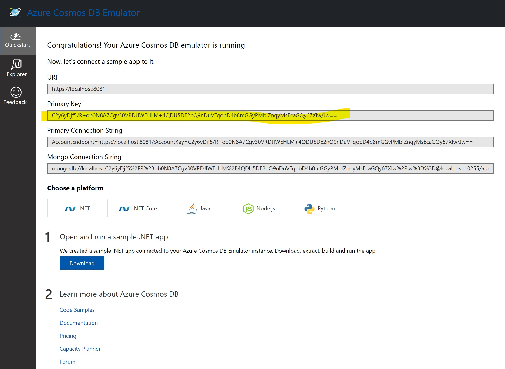
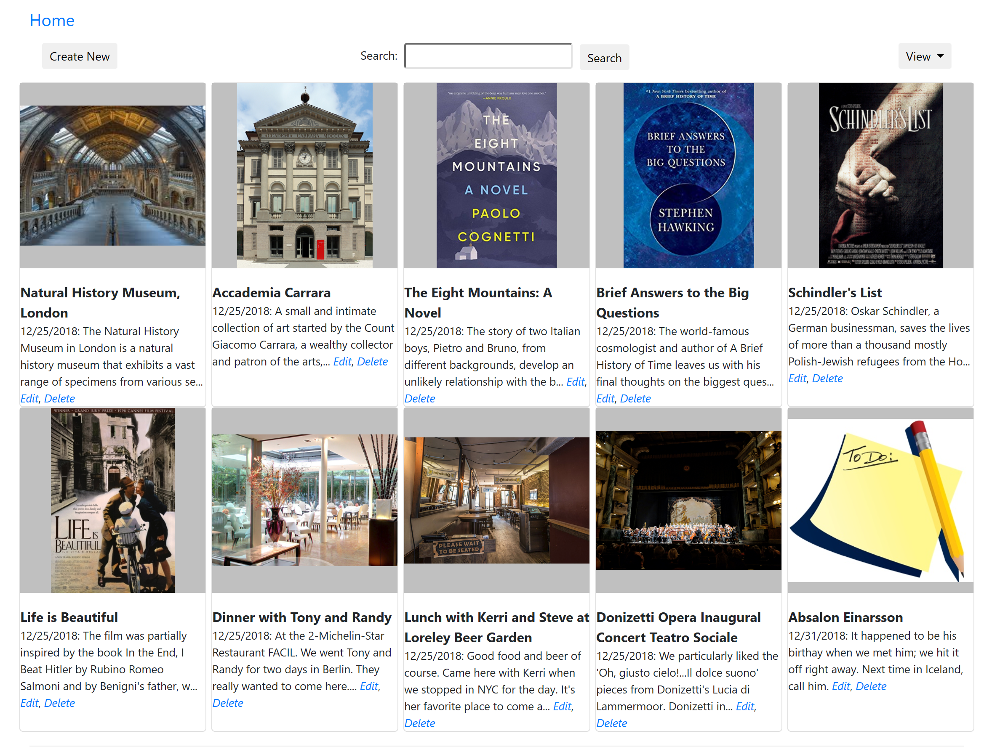

# Get Started

To build the {{productName}} app on Windows use the following:

* [Visual Studio Community Edition][vsdown]  
* [Azure Cosmos DB Local Emulator][emul]
* [Bing Maps Basic Key][bingmap] (optional)

Install these components on your development or local server. This server will be your local run/test environment as well as the publish point to push changes live, if you choose to do so.

Visual Studio has different workloads that can be installed. If you are running {{productName}} on ASP.NET for Windows, then you need the *ASP.NET and web development* workload. If you are running {{productName}} on ASP.NET Core, then you need the *.NET Cross-platform development workload*. For more information on workloads, see [Selecting Workloads in Visual Studio 2017][work].

After installing the Cosmos DB Emulator, confirm that you can run Cosmos DB Local Emulator. You should see a screen like the following image. 

## Run local

Running {{productName}} locally, you can try out your ideas at no cost or risk. Here are the steps:

1. Clone (<https://github.com/travelmarx/scrapbook101core.git>) or download the {{productName}} code and open it as a solution in Visual Studio. The source code in the
`{{productName}}` folder. 

1. Open the solution in Visual Studio. For example, open the solution file `{{productName}}.sln`.

1. Customize the code as follows in the `<code>`appsettings.json` file.
    * Enter the correct value for **AuthKey**, which you can get from the local emulator home page as show above.

    * Enter a Bing Maps Key for **BingMapKey** if you have one; if blank, then geocoding is skipped.

    * Set the value for **AddTestAssets** to `true` to write test assets or `false` not to write them.

  There are other `appsettings.json` settings you can change, but the three above are the enough to get started. For information on running locally for the ASP.NET MVC version of this project (called Scrapbook101), see <https://travelmarx.github.io/scrapbook101/get-started#run-local>.

With the Cosmos DB Local Emulator running, run the solution (Visual Studio F5) and view {{productName}} in a browser, e.g. https://localhost:port#/. You should see something ressembling the following screenshot:

Here's what happened on startup:

1. In the document store, a database named **Scrapbook101** was created with a collection named **Items**.

1. A [category document][cat] was created and stored in the document store. The category information was read from the file `Assets/categories-document.json`.

1. If the configuration option **AddTestAssets** to create test assets was set to `true` in 
    `appsettings.json`, then test items were added to the document store as well. They were read from the file `Assets/categories-document.json`.

For information on what happened on startup for the ASP.NET MVC version of this project (called Scrapbook101), see <https://travelmarx.github.io/scrapbook101/get-started#run-local>.

## Create an item

At this point, you can start working with {{productName}} items with CRUD (create, read, update, delete) operations. The home page is https://localhost:port#/ or https://localhost:port#/Item/Index.

To create a new {{productName}} item.

1. On the home page, select **Create**.
2. Choose a category in the **Category** dropdown.
3. Fill in the **Title** field.
4. Select **Save** or continue to fill in fields.

## Run live

After running {{productName}} locally, you can take an optional next step and run {{productName}} as a web service. To do this you need to go live, which means publishing your site live with the following services:

- [Azure Cosmos DB Service][cosmos] - This works the same as local emulator and you can copy any documents created locally to the live service. 
 
* [Azure Application Service][azapp] - You can publish your site directly from Visual Studio to the Azure Application service.

Using Azure Cosmos DB Service, you will eventually incur charges, but be sure to take advantage of any limited, free tier offers. 

There are a couple of other considerations when going live. In the least, you should consider:

* Authentication and authorization.
* Transfering any documents from local emulator to live service.
* Dealing with asset storage.

These and other topics are discussed in [Next Steps][next-steps] and [Handling Assets][handling-assets].

[next-steps]: next-steps.md
[handling-assets]: handling-assets.md
[item]: item-document.md
[cat]: category-document.md
[vsdown]: https://visualstudio.microsoft.com/downloads/
[emul]: https://docs.microsoft.com/en-us/azure/cosmos-db/local-emulator
[cosmos]: https://azure.microsoft.com/en-us/services/cosmos-db/
[azapp]: https://azure.microsoft.com/en-us/services/app-service/
[bingmap]: https://www.microsoft.com/en-us/maps/create-a-bing-maps-key
[azblob]: https://azure.microsoft.com/en-us/services/storage/blobs/
[work]: https://visualstudio.microsoft.com/vs/support/selecting-workloads-visual-studio-2017/