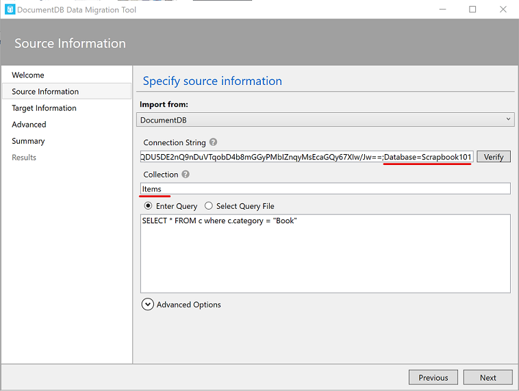

# Next Steps

After following the steps in [Get Started][gs], you may be wondering what's next. There are many directions you can go in depending on what you are trying to do. Below, we present a few ideas of what to think about next including security, improved search and styling, and paging.

## Security

*Authentication* is verifying the identify of a person or device (an account in general). {{productName}} does not have authentication implemented, but it can be added. This is especially important when running live. For example, you can add code to allow users to sign in with [Google][auth-goog], [Facebook][auth-fb], [Microsoft][auth-msft] accounts as well as by other means. Even if your {{productName}} implementation is open, tracking who makes and edits entries is useful. This can be done by capturing the associated email or user name and using that in the **updatedBy** field in the [item-document][item].

If the intent of your {{productName}} implementation is to allow only certain accounts access, then you need to additionally set up *Authorization*, that is, associating privileges to specific accounts. In fact, you should never store personal information (be it with {{productName}} or any other means) without authentication and authorization in place. For an overview of security in ASP.NET Core, see [Introduction to authorization in ASP.NET Core][auth-core]. The approaches discussed there could be useful when running locally. When running as a web service such as in Microsoft Azure, see [Advanced usage of authentication and authorization in Azure App Service][auth-adv].

## Searching

The search functionality implemented in {{productName}} allows searching titles for a string fragment. The code to do
this is in the `ItemController.cs` file's `SearchAsync` method, which uses [LINQ][linq]:

```C#
var items = await DocumentDBRepository<Item>.GetItemsAsync(
    item => item.Type == AppVariables.ItemDocumentType
    && item.Title.ToLower().Contains(searchString.ToLower()));
```
The included functionality is basic but can be expanded to include searching the **description**, **location**, and **dateAdded** fields. For example, to search both the **title** and the **description**, you could use

```C#
var items = await DocumentDBRepository<Item>.GetItemsAsync(
    item => item.Type == AppVariables.ItemDocumentType
    && (item.Title.ToLower().Contains(searchString.ToLower())
    || item.Description.ToLower().Contains(searchString.ToLower())));
```

## Styling

The create, delete, update, and edit pages (under the `Views\Item` folder) are currently minimally styled. They can be improved and rearranged as needed. For example in the edit page, the **description** field can be customized for long or short descriptions and fields that can't or shouldn't be changed (like **id** and **type**) can be removed from the form. 

In contrast to the CRUD pages, the {{productName}} main page (`Views\Item\Index.cshtml`) is styled more. We use [Bootstrap][boot] to demonstrate a possible visual representation of {{productName}} items. Specifically, Bootstrap [cards][bootcard] structure is used which shows one asset image if it exists or else show a default image as specified in the configuration file (either `web.config` or `appsettings.json`) along with a snippet of the title and description of the item.  

<ul class="nav nav-tabs" role="tablist">
  <li class="nav-item">
    <a class="nav-link active" href="#styling1" role="tab"
    data-toggle="tab">ASP.NET MVC</a>
  </li>
  <li class="nav-item">
    <a class="nav-link" href="#styling2" role="tab"
    data-toggle="tab">ASP.NET Core</a>
  </li>
</ul>

<div class="tab-content">
  <div role="tabpanel" class="tab-pane aspnetmvc active" id="styling1">
    <p class="single">
    All the scripts for styling are injected in <code>Views\Shared\__Layout.cshtml</code>. 
    A more practical approach is to bundle
    the scripts together and include them in the <code>App_Start\BundleConfig.cs</code>.
    </p>
  </div>
  <div role="tabpanel" class="tab-pane aspnetcore" id="styling2">
    <p class="single">
    All the scripts for styling are injected in <code>Views\Shared\__LayoutScrapbook.cshtml</code>. A more practical approach is to bundle the scripts together and include them using a tool such as 
    <a href="https://marketplace.visualstudio.com/items?itemName=MadsKristensen.BundlerMinifier">Bundle & Minifier</a> or <a href="https://www.nuget.org/packages/BuildBundlerMinifier/">BuildBundleMinifier</a>.
    </p>
  </div>
</div>

## Paging

Paging is not currently implemented for {{productName}}. Paging features can be added by modifying the search results in the `ItemController.cs` file where results are returned in the `SearchAsync` method and returned to `Views\Item\Index.cshtml`.  

Our experience running our personal version of Scrapbook with over 6000 entries and without paging is that we don't miss not having the functionality. We show one page of results for a search. If we don't find what we want, we make the search more precise or change the number of results displayed. This is sufficient for most of the searches we make so that we haven't felt the need to implement paging. Takeaway message: don't implement paging until you have other more important features like security and searching in place first.

## Import data

If you ran {{productName}} locally and start to add entries and then decide to go-live, you can transfer your local data to your on-line data-store using the [Azure Cosmos DB Data Migration tool][migration]. When using the migration tool, be sure to correctly set the **Connection String** and **Collection** fields. For example, after running the {{productName}} code you should have a database "Scrapbook101" with a collection "Items". These values are used in the migration tool as shown in the following screenshot.



[gs]: get-started.md
[item]: item-document.md
[boot]: https://getbootstrap.com
[bootcard]: https://getbootstrap.com/docs/4.0/components/card/
[auth-fb]: https://docs.microsoft.com/en-us/azure/app-service/configure-authentication-provider-facebook
[auth-goog]: https://docs.microsoft.com/en-us/azure/app-service/configure-authentication-provider-google
[auth-msft]: https://docs.microsoft.com/en-us/azure/app-service/configure-authentication-provider-microsoft
[auth-adv]: https://docs.microsoft.com/en-us/azure/app-service/app-service-authentication-how-to
[auth-core]: https://docs.microsoft.com/en-us/aspnet/core/security/authorization/introduction?view=aspnetcore-2.2
[migrate]: https://docs.microsoft.com/en-us/azure/cosmos-db/import-data
[newton]: https://www.newtonsoft.com/json
[migration]: https://docs.microsoft.com/en-us/azure/cosmos-db/import-data
[linq]: https://docs.microsoft.com/en-us/dotnet/csharp/tutorials/working-with-linq
[bundle1]: https://marketplace.visualstudio.com/items?itemName=MadsKristensen.BundlerMinifier
[bundle2]: https://www.nuget.org/packages/BuildBundlerMinifier/
