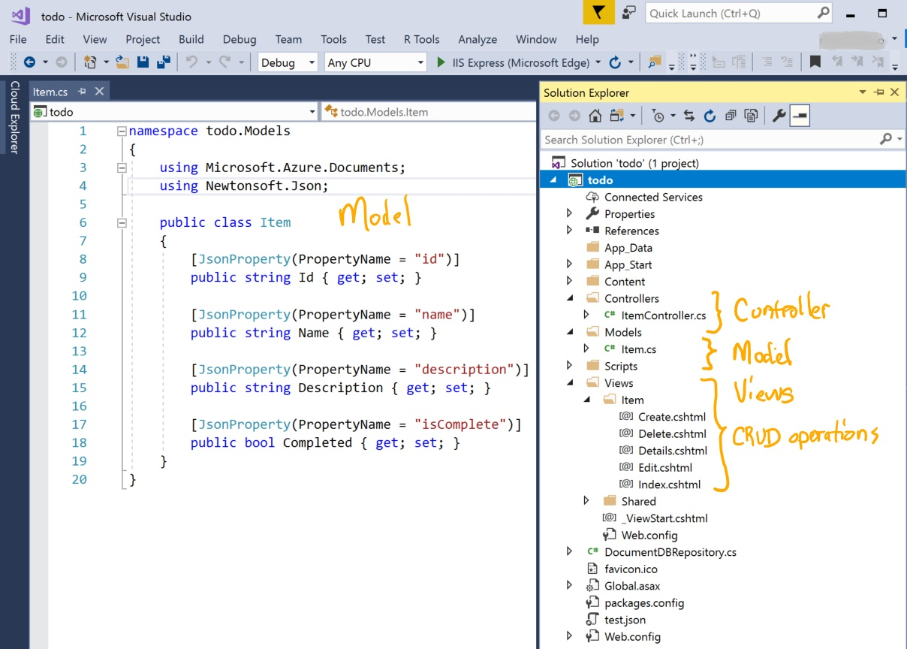

# Technology Overview

The two main technologies underlying {{site.sn}} are how data is stored using a NoSQL data storage approach and how we present and interact with the data in a browser using a Model-view-controller (MVC) software pattern. We discuss these two technologies here along with a quick introduction to geocoding as used in {{site.sn}}.

## NoSQL

NoSQL is a broad term that refers to storage and retrieval of data that is ***not*** modeled in a relational way, that is, with columns and rows where each row is uniquely identified by it's own key. 

It's helpful to think about NoSQL databases as providing solutions for classes of problems that require more flexibility for storing data, be it a document store to store documents, a graph database to represent relationships, or a key/value store for accessing essential information in a simplified way. These classes of problems arose with the surge in social networking and big data applications, and are examples where relational databases can't adequately address the problem, in particular, performing at scales required by these new classes of problems.

We can also say that NoSQL data storage solutions do not have a fixed schemas but intead have flexible schemas. What does flexible mean? It means a schema - at least as we are interpreting for {{site.sn}} - that is defined outside of the database and is easier for application developers to work with and change. How is it easier for application developer? Here, we show just one simple example of how by defining our "prototype" document schema in JSON and then creating a programming class representation of that. In this way, processing of the data in the database and changes to the schema are more developer-centric.

For more background reading on schemas and relational versus NoSQL databases, see 
[NoSQL Database Doesn’t Mean No Schema][ref1nosql].

### Document-oriented

[Microsoft Azure Cosmos DB][cosmos] is a multi-modeled database service that supports NoSQL databases called [document-oriented data stores][docdb], which is what {{site.sn}} uses. In document-oriented data stores, data is stored in *documents* where each document can differ slightly (if needed) in its schema while remaining part of a larger database collection. Documents are roughly equivalent to an object be it represented in code or JSON.

Each {{site.sn}} item (or object) is represented as in the document data store as one document in JSON. For example, an item representing a book could be represented by the following:

```json
{
    "id": "GUID",
    "title": "Book title",
    "category": "Book",
    "description": "Notes on the book",
    "rating": 3,
    "categoryFields": {
        "author": "book author",
        "pubYear": 2010
    }
}
```

In a relational database, the data that consitutes a {{site.sn}} item would be spread across separate (normalized) tables whereas in a document-oriented data store, each item is stored in one document, all pieces of information together. Each {{site.sn}} item's document, as mentioned previously, can be different in terms of its schema. For example, if {{site.sn}} includes book and film items, the documents for a film and a book might share some data aspects (JSON fields) but differ on others. For example, compare the book item above with the following film item:

``` json
{
    "id": "GUID",
    "title": "Film title",
    "category": "Film",
    "description": "Notes on the film",
    "rating": 4,
    "categoryFields": {
        "director": "Film director",
        "releaseYear": 2010
    }
}
```

The two documents share common fields like **id**, **title**, **description**, and **rating** and differ on other fields that are specific to the category of the item. The {{site.sn}} [schema](/prototype-document) is a bit more complex than the book and film example above, but the idea is essentially the same. 

### CRUD

With Cosmos DB, you have the usual CRUD (create, read, update, delete) operations on the documents in the data store. And you can use SQL-like query language to query the document store. For example, in the local emulator you can create a query to search for documents. The following image shows a query that finds items with a rating greater than 3.


In the {{site.sn}} code, similar queries are constructed using Language Integrated Queries ([LINQ][linq]).

### Origins

The {{site.sn}} code was initially built starting with the [ASP.NET MVC][aspmvc] To-Do List app and customizing it. From that version, the ASP.NET core version was created. 

The To-Do list is a simple list of items with three pieces of tracked information: name, description, and status (completed or not completed). The To-Do List app allows CRUD operations. After running the To-Do list sample and looking in the document store, you will see documents that look like the following:

```json
{
    "id": "GUID",
    "name": "To-do item 1",
    "description": "This is item 1 description.",
    "isComplete": false,
}
```
While {{site.sn}} is more complex, that is, more pieces of information are tracked and document JSON structure can change as shown in the book/film example above, the idea is essentially the same as the To-Do list. 

## MVC

The second technology that underlies {{site.sn}} is the [Model-view-controller][mvcwiki] (MVC) software pattern. This pattern is commonly used to divide an application into functional pieces. Doing so has the advantages of better code reuse, parallel development, and ease of modification. The main challenge many encounter with MVC is that there is an initial learning curve getting used to thinking in terms of the three components (model, view, and controller) and understanding how they communicate.

{{site.sn}} is built around the MVC pattern as supported by the [.NET Framework][aspmvc] as well as [.NET Core][coremvc]. The ASP.NET MVC Visual Studio project file is [here][scrapmvc] and the ASP.NET Core Visual Studio project file is [here][scrapcore]. For more on the difference between the .NET Framework and .NET Core, see [The Difference Between .NET Framework and .NET Core][diff].

The model-view-control pattern is supported by many programming languages such as Java, Ruby, Python and JavaScript. For example, the [TodoMVC][todomvc] project shows many different implementations in JavaScript-based frameworks. 

Taking the To-Do list application and looking at it in Visual Studio gives a good idea of working with MVC in ASP.NET. In this example, note the representation of the JSON notation of an item in C# code.




## Geocode

{{site.sn}} can be used with Bing Maps [geocoding][geocode]. Geocoding is the process of converting an address presented as a string ("Seattle, WA, USA") into a location on Earth represented by geographical coordinates (latitude and longitude).  Each {{site.sn}} item has an associated **location** that contains a string value such as "Seattle, WA, USA" or "Italy".

If you set the `bingMapKey` key in the `web.config` file to a valid key, then geocoding is enabled and addition to the **location**, a **geoLocation** value is calculated that contains the geographical coordinates corresponding to the string value. If The `bingMapKey` key is blank, which it is by default, no geocoding is performed.

Why is geocoding important? With the intuitive nature of searching for information with a map and the integration of maps in many aspects of our lives, it is important to associated {{site.sn}} items with geocodes that are universal and independent of string names. A good analogy is in botany when referring to a plant. The most accurate way to refer to a plant is by its scientific name rather than its common name, which depends on location and language.

Taking the example above and using the [Bing Maps Rest Service][bingrest] with an unstructured URL, we can test finding the geocode for "Seattle, WA" as follows:

```
http://dev.virtualearth.net/REST/v1/Locations?
    query=Seattle,WA&include=includeValue&
    maxResults=1&key=BingMapsKey
```

we are returned the followng response (truncated for simplicity):

```json
{
    "authenticationResultCode":"ValidCredentials",
    "resourceSets":[
        {"estimatedTotal":1,
        "resources":[
            {
            "confidence":"High",
            "entityType":"PopulatedPlace",
            "geocodePoints":[
                {"type":"Point",
                "coordinates":[47.6035690307617,-122.329452514648],
                "calculationMethod":"Rooftop",
                "usageTypes":["Display"]
                }
            ],
            "matchCodes":["Good"]
            }
            ]
        }
        ],
    "statusCode":200,
    "statusDescription":"OK"
}
```
The latitude (47.6035690307617) and longitude (-122.329452514648) are what would be stored with the {{site.sn}} item **geoLocation** field in the [item document][item-document].

[item-document]: item-document.md
[aspmvc]: https://www.asp.net/mvc
[coremvc]: https://docs.microsoft.com/en-us/aspnet/core/mvc/overview?view=aspnetcore-2.2
[mvcwiki]: https://en.wikipedia.org/wiki/Model%E2%80%93view%E2%80%93controller
[todomvc]: http://todomvc.com/
[docdb]: https://en.wikipedia.org/wiki/Document-oriented_database
[ref1nosql]: https://medium.com/capital-one-tech/nosql-database-doesnt-mean-no-schema-a824d591034e
[cosmos]: https://azure.microsoft.com/en-us/services/cosmos-db/
[linq]: https://en.wikipedia.org/wiki/Language_Integrated_Query
[bingmap]: https://www.microsoft.com/en-us/maps/create-a-bing-maps-key
[bingrest]: https://msdn.microsoft.com/en-us/library/ff701715.aspx
[geocode]: https://en.wikipedia.org/wiki/Geocoding
[scrapmvc]: https://github.com/travelmarx/scrapbook101
[scrapcore]: https://github.com/travelmarx/scrapbook101core
[diff]: https://www.c-sharpcorner.com/article/difference-between-net-framework-and-net-core/